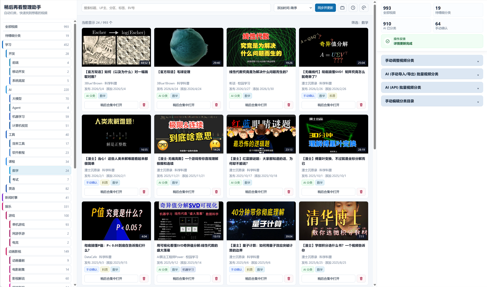

# 稍后再看整理助手

当前版本：1.0.0

这是一个给屯屯鼠准备的 B站稍后再看分类插件。它会把越攒越多的稍后再看视频整理成清晰的分类目录，让你更快找到真正想看的内容，而不是继续在长长的列表里翻找。

插件可以先在本地完成快速的初步分类，也支持使用 AI 进一步批量分类，以及手动确认重要视频。手动确认的结果优先级最高，不会被后续的自动分类覆盖。

## 主要功能

- 同步 B站稍后再看列表，并补充视频标题、UP 主、分区等信息。
- 按分类目录浏览、搜索和筛选视频。
- 在本地进行初步分类，不需要配置 API。
- 使用 OpenAI-compatible API 进行 AI 批量视频分类。
- 通过复制 Prompt、导入 JSON 的方式使用 ChatGPT、Gemini 等 AI，无需提供 API Key。
- 单个或批量手动调整视频分类。
- 从稍后再看中移出不需要的视频。

## 安装

目前请通过“加载已解压的扩展程序”安装：

1. 下载本项目源码并解压到一个固定文件夹。
2. 在 Chrome 中打开 `chrome://extensions/`，或在 Edge 中打开 `edge://extensions/`。
3. 开启页面右上角的“开发者模式”。
4. 点击“加载已解压的扩展程序”，选择包含 `manifest.json` 的项目文件夹。
5. 登录 B站，然后点击浏览器工具栏中的插件图标。

更新插件时，用新文件替换原文件，再回到扩展管理页点击“重新加载”。不要随意移动或删除插件文件夹，否则浏览器将无法继续加载插件。

## 首次使用

首次打开“稍后再看整理助手”后，按页面引导完成以下设置：

1. 确认当前浏览器已登录 B站，插件会同步你的稍后再看列表。
2. 设置分类目录。你可以直接使用默认目录、手动编辑目录、让 AI 生成目录，或导入 AI 生成的目录。
3. 选择整理方式：手动调整视频分类、AI (API) 批量视频分类，或 AI (手动导入/导出) 批量视频分类。

分类目录决定“有哪些分类”；视频分类决定“每个视频放在哪里”。生成或编辑分类目录不会自动完成全部视频的 AI 分类。

插件中的分类分为三种：

- **初步分类**：插件根据标题、分区等信息在本地快速判断，适合先把大量视频粗略整理起来。
- **AI 分类**：AI 阅读视频信息后进行更细致的判断。
- **手动确认**：由你亲自保存，优先级最高，不会被自动流程覆盖。

## 日常使用

点击浏览器工具栏图标，或点击 B站首页右侧的蓝色圆形入口，即可打开整理助手。

- 左侧分类目录用于浏览不同类别的视频。
- “待精细分类”会集中显示只有初步分类、结果过旧、结果不确定或分类异常的视频。
- 顶部“同步并更新”用于获取最新的稍后再看列表和缺失的视频信息。
- 点击视频封面可打开普通视频页；点击“稍后合集中打开”可进入 B站稍后再看播放上下文。
- 点击视频卡片可展开“手动调整视频分类”。
- 点击视频卡片上的删除图标，可在确认后将视频移出稍后再看。

## 批量管理

需要一次整理多个视频时：

1. 在右侧“手动调整视频分类”中点击“批量管理”。
2. 点击视频卡片逐个选择，或在视频区域拖拽框选多个视频。
3. 选择要添加、移除或替换的分类。
4. 确认批量操作并保存。

你也可以使用两种 AI 批量方式：

- **AI (API) 批量视频分类**：填写 API URL、模型和 API Key，设置每批数量后直接在插件中运行。配置保存在扩展本地存储中。
- **AI (手动导入/导出) 批量视频分类**：生成 Prompt，复制给 ChatGPT 或 Gemini，再将 AI 返回的 JSON 粘贴回插件导入。

批量自动分类会跳过手动确认的视频，失败的批次也不会清空已经成功保存的结果。

## 数据与隐私

- 视频信息、分类结果和处理队列保存在扩展自己的 IndexedDB 中。
- 设置、分类目录和 AI API 配置保存在 `chrome.storage.local` 中。
- 插件不会保存 B站 Cookie，不会上传浏览历史，也不会保存视频封面文件。
- 初步分类完全在本地运行，不调用外部 AI 服务。
- 只有在你主动使用 AI 分类时，所选 API 服务才会收到分类所需的视频文本信息。
- 卸载插件通常会同时删除扩展本地数据，请在卸载前自行确认是否需要保留重要设置。

## 使用提示

- 如果同步失败，请先确认当前浏览器已登录 B站，再重新打开整理助手。
- 如果 AI 分类失败，请检查 API URL、模型名称、API Key 和服务余额。
- 不同 AI 服务对 JSON 输出格式的支持不同；遇到兼容问题时，可以关闭“请求 JSON response_format”后重试。
- 本项目与哔哩哔哩官方无关，B站页面或接口变化可能影响部分功能。
